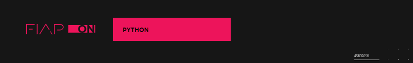
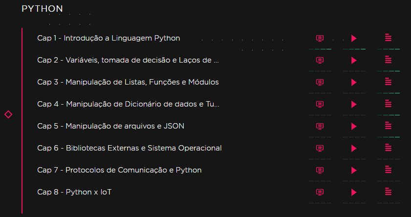

# Curso : FIAP ON - Nano Courses - Python

<h2 align="center">
    
</h2>

<h2 align="center">
    
</h2>

> Ultima Aula Assistida : Capitulo 2 Incompleto

### Cap 1 : Introdução a Linguagem Python

```bash
# Pasta do Projeto
|- /MeusProjetos_Python
  |- /PrimeiroProjeto
    |- HelloWorld.py

# Clone este repositório
$ git clone https://github.com/brunoemferreira/FIAP-ON-Nano-Courses-PYTHON.git

# Acesse a pasta do projeto no terminal/cmd
$ cd MeusProjetos_Python

# vá para a pasta crud-simples-udemy
$ cd PrimeiroProjeto
```

### Cap 2 : Variáveis, tomada de decisão e Laços de...

```bash
# Pasta do Projeto
|- /MeusProjetos_Python
  |- /Capitulo2-Decisoes
    |- DecisaoSimples.py
  |- /Capitulo2-Variaveis
    |- Variaveis.py
    |- Variaveis2.py


# Clone este repositório
$ git clone https://github.com/brunoemferreira/FIAP-ON-Nano-Courses-PYTHON.git

# Acesse a pasta do projeto no terminal/cmd
$ cd MeusProjetos_Python

# vá para a pasta crud-simples-udemy
$ cd PrimeiroProjeto
```
